# Mini-projet Docker 

Les instructions pour le projet **student_list** se trouvent [ici](https://github.com/diranetafen/student-list.git "ici")

 

---

Auteur : Sid Ahmed Rabhi

Date : 09 janvier 2024

LinkedIn : https://www.linkedin.com/in/sid-ahmed-rabhi/

Portfolio : https://www.sid-rabhi.fr/

---

## L'objectif

Déployer une application nommée **" student_list "**, très basique, qui permet à POZOS d'afficher la liste de certains étudiants avec leur âge, et par la suite offrir un registre privé pour stocker les images.

L'application student_list comporte deux modules :

- Le premier module est une API REST (nécessitant une authentification de base) qui envoie la liste souhaitée des étudiants basée sur un fichier JSON
- Le deuxième module est une application web écrite en HTML + PHP qui permet à l'utilisateur final d'obtenir une liste d'étudiants

## Le besoin

- Élaborer un conteneur dédié à chaque module.
- Établir des interactions entre ces différents conteneurs.
- Offrir un registre privé pour stocker les images Docker.

## Le Plan

- Créer un **Dockerfile** pour construire l'image du conteneur api.
- Créer un **docker-compose.yml** pour lancer l'application (API et application web), le registre local et son interface utilisateur.

---

## Étapes de réalistion du projet

1. **Construire l'image de l'API**

- Aller répertoire *simple_api* 

```bash
cd ./simple_api/
```
- Construite l'image *student-list* à partir du **Dockerfile**

```bash
docker build -t student-list .
```


2. **Tester l'image de l'API**

- Lancer le conteneur de l'API `api-student-list`

```bash
docker run -d --name api-student-list  -p 5000:5000 -v ./student_age.json:/data/student_age.json student-list
docker ps -a
```


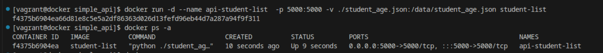

- Tester l'API avec un curl

```bash
curl -u toto:python -X GET http://192.168.56.16:5000/pozos/api/v1.0/get_student_ages
```

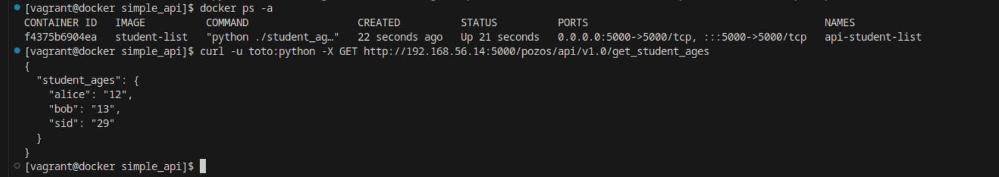


3. **Création du network**

- Création du network `student-list-net`

```bash
docker network create student-list-net
docker network ls
```

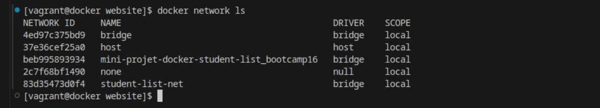

- Relancer le conteneur `api-student-list` en l'affectant au network `student-list-net`

```bash
docker rm -f api-student-list
docker run -d --name api-student-list  -p 5000:5000 --network student-list-net -v ./student_age.json:/data/student_age.json student-list
```

- Modification de l'URL dans le fichier `index.php` se trouvant dans le dossier website

```bash
cd ..
cd website
```


4. **Lancement de l'application web**

- Création du conteneur de l'application web qu'on va nommer `ihm-student-list` en utilisant le `USERNAME` et `PASSWORD` comme variable d'environnement, avant de lancer la commande il faut qu'on se positionne sur le répertoire `website`

```bash
docker run -d --name ihm-student-list  -p 80:80 --network student-list-net -v ./:/var/www/html/ --env USERNAME=toto --env PASSWORD=python php:apache
```

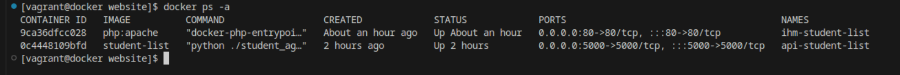

- Tester si l'application récupére la liste des étudiants sur l'url suivant `http://192.168.56.14:80`

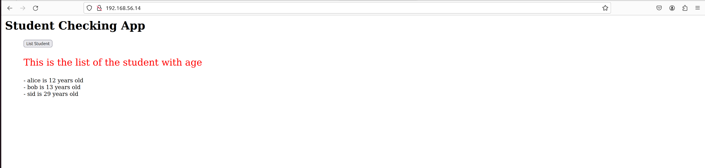

5. **Mise en place du fichier docker-compose.yml**

- Créer un registre et son UI en utilisant l'image `registry:2` pour le registre, et `joxit/docker-registry-ui:static` pour son interface utilisateur frontend et passé quelques variables d'environnement

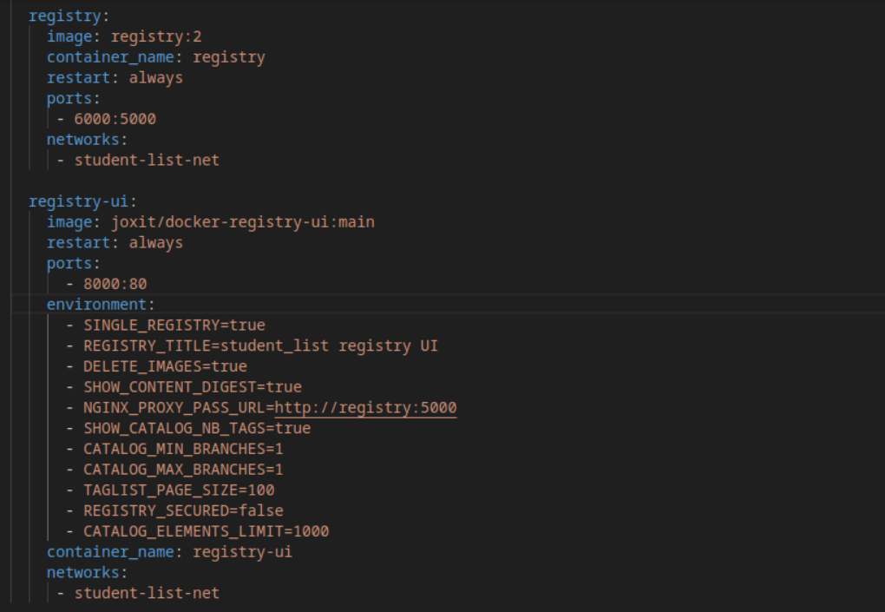

- Pour pousser mon image sur le `registry` il faut suivre ce schéma de tag `localhost:6000/nom-de-image:latest`

```bash
docker image tag student-list localhost:6000/student-list:latest
```
- Noter qu'il faut que le conteneur du registre soit impérativement en UP pour pouvoir pousser l'image

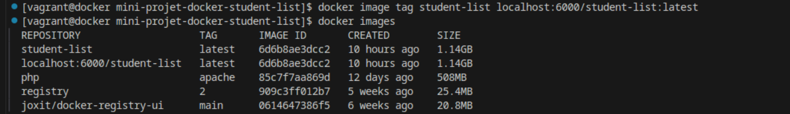

```bash
docker push localhost:6000/student-list
```
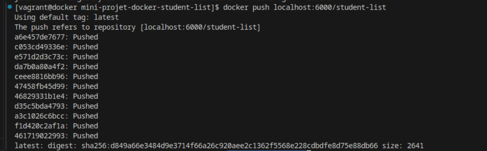

- Éxecuter le fichier `docker-compose.yml` pour ainsi permettre le déploiement simultané du front-end et back-end de l'application ainsi que le registre privé et son interface, et les mettre dans le même réseau `student-list-net` 

```bash
cd ..
docker-compose up -d
```

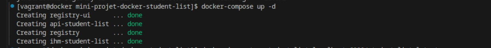


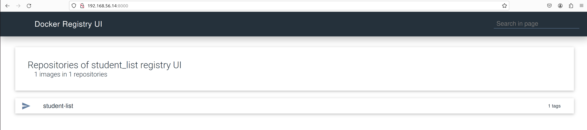

---

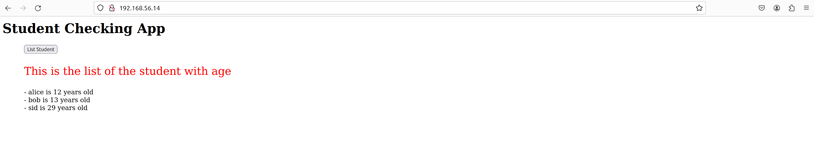

## Conclusion

Ce projet de déploiement de l'application **"student_list"** a représenté une expérience significative en DevOps, focalisée sur l'utilisation de Docker pour orchestrer des microservices. À travers la création d'images Docker personnalisées pour une API REST et une application web en HTML + PHP, la configuration d'interactions via un réseau dédié et l'intégration d'un registre privé pour stocker les images, cette initiative a permis de mettre en pratique les principes fondamentaux des microservices. En combinant des technologies telles que Docker, docker-compose, ainsi que des réseaux et volumes pour faciliter la communication entre les différents modules, ce projet a renforcé mes compétences en matière de conteneurisation et de déploiement. Il a également mis en évidence l'efficacité des microservices pour assurer la scalabilité, la modularité et la flexibilité des applications, ouvrant ainsi la voie à une utilisation future plus étendue de ces concepts dans des projets similaires et dans l'amélioration continue des processus de déploiement au sein d'équipes et d'organisations.
