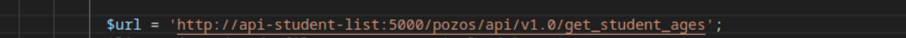

# Mini-projet Docker 

Les instructions pour le projet **student_list** se trouvent [ici](https://github.com/diranetafen/student-list.git "ici")

 

---

Auteur : Sid Ahmed Rabhi

Contexte : formation Bootcamp DevOps promotion 16

Centre de formation : Eazytraining

Période : novembre-décembre-janvier

Date : 06 janvier 2024

LinkedIn : https://www.linkedin.com/in/sid-ahmed-rabhi/

---

## L'objectif

Déployer une application nommée **" student_list "**, très basique, qui permet à POZOS d'afficher la liste de certains étudiants avec leur âge, et par la suite offrir un registre privé pour stocker les images.

L'application student_list comporte deux modules :

- Le premier module est une API REST (nécessitant une authentification de base) qui envoie la liste souhaitée des étudiants basée sur un fichier JSON
- Le deuxième module est une application web écrite en HTML + PHP qui permet à l'utilisateur final d'obtenir une liste d'étudiants

## Le besoin

- Élaborer un conteneur dédié à chaque module.
- Établir des interactions entre ces différents conteneurs.
- Offrir un registre privé pour stocker les images Docker.

## Le Plan

- Créer un **Dockerfile** pour construire l'image du conteneur api.
- Créer un **docker-compose.yml** pour lancer l'application (API et application web), le registre local et son interface utilisateur.

---

## Étapes de réalistion du projet

1. **Construire l'image de l'API**

- Aller répertoire *simple_api* 

```bash
cd ./simple_api/
```
- Construite l'image *student-list*

```bash
docker build -t student-list .
```


2. **Tester l'image de l'API**

- Lancer le conteneur de l'API `api-student-list`

```bash
docker run -d --name api-student-list  -p 5000:5000 -v ./student_age.json:/data/student_age.json student-list
docker ps -a
```


- Tester l'API avec un curl

```bash
curl -u toto:python -X GET http://192.168.56.14:5000/pozos/api/v1.0/get_student_ages
```


2. **Création du network**

- Création du network `student-list-net`

```bash
docker network create student-list-net
docker network ls
```


- Relancer le conteneur `api-student-list` en l'affectant au network `student-list-net`

```bash
docker rm -f api-student-list
docker run -d --name api-student-list  -p 5000:5000 --network student-list-net -v ./student_age.json:/data/student_age.json student-list
```

- Modification de l'URL dans le fichier `index.php` se trouvant dans le dossier website

```bash
cd ..
cd website
```



